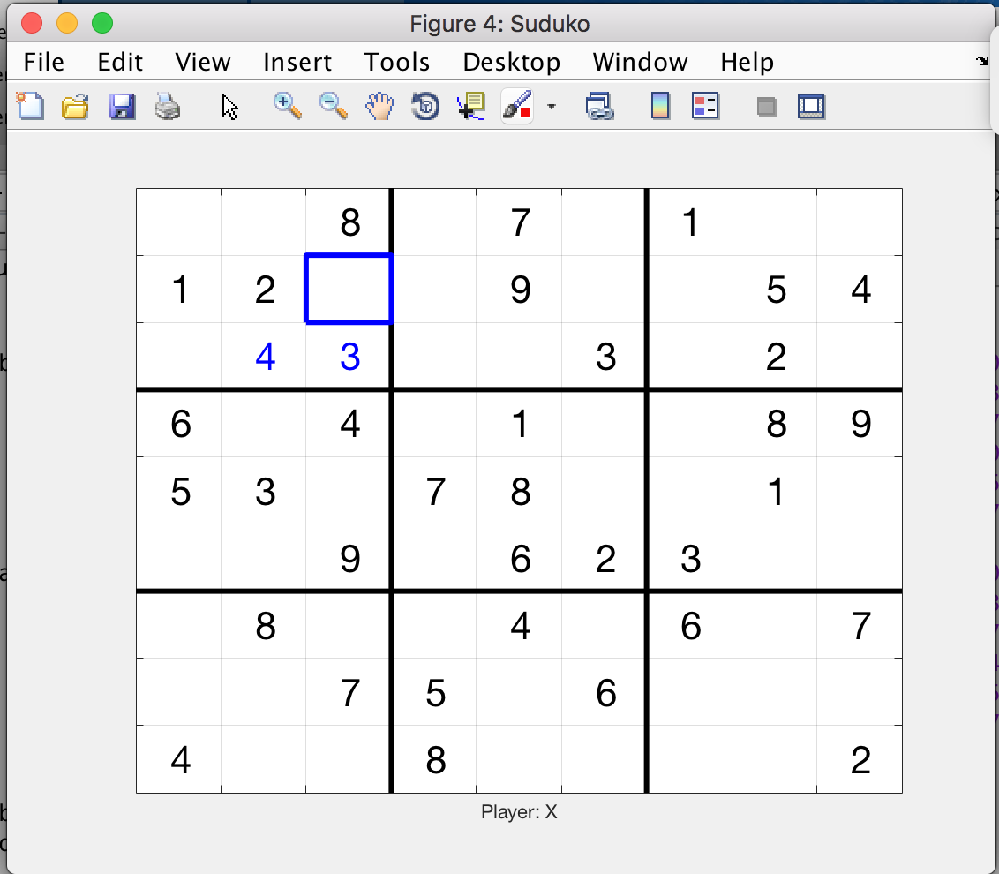

# Matlab-Suduko

 > quick and easy implementation of Suduko in Matlab
 
Is playable, but could be much more efficent.

Future Improvements:
  1. Add suduko solver
  2. stop plot from refreshing
  3. Add more boards 
  4. Organize boards by difficulty
  5. Add UI

Repository include PowerPoint created by another student explaining the code.

